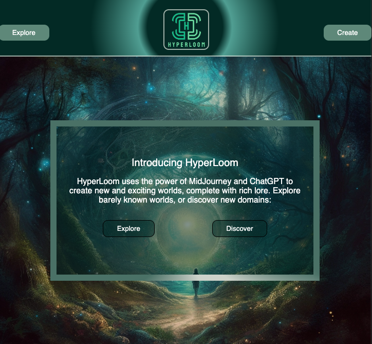
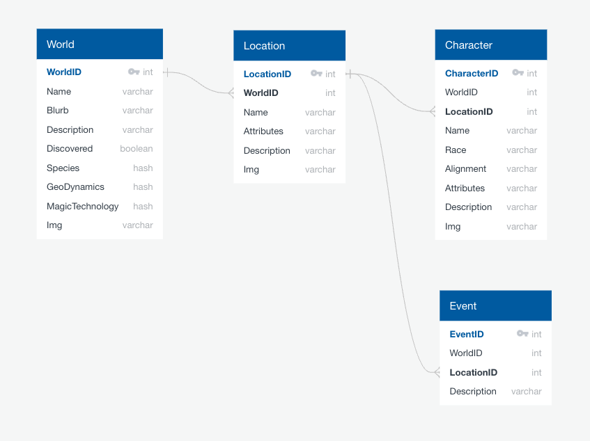
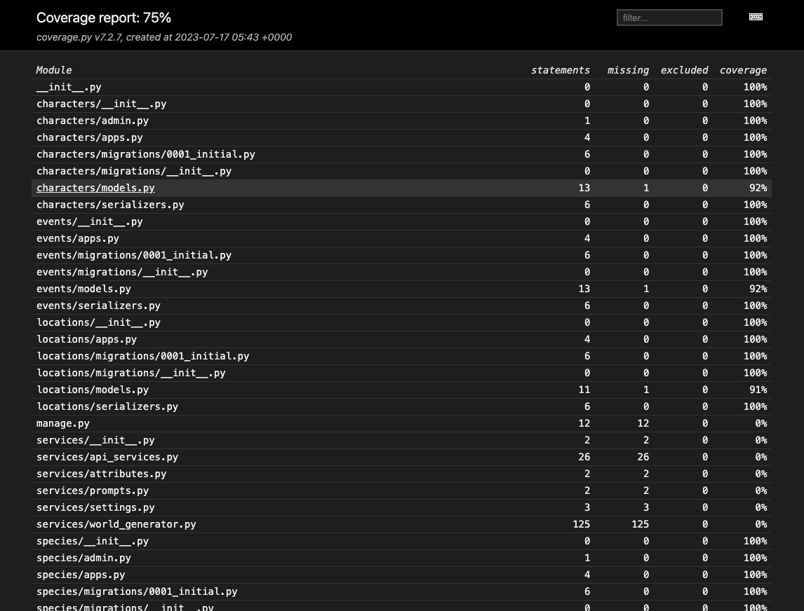

<!-- Improved compatibility of back to top link: See: https://github.com/othneildrew/Best-README-Template/pull/73 -->
<a name="readme-top"></a>
<!--
*** Thanks for checking out the Best-README-Template. If you have a suggestion
*** that would make this better, please fork the repo and create a pull request
*** or simply open an issue with the tag "enhancement".
*** Don't forget to give the project a star!
*** Thanks again! Now go create something AMAZING! :D
-->

<!-- PROJECT SHIELDS -->
<!--
*** I'm using markdown "reference style" links for readability.
*** Reference links are enclosed in brackets [ ] instead of parentheses ( ).
*** See the bottom of this document for the declaration of the reference variables
*** for contributors-url, forks-url, etc. This is an optional, concise syntax you may use.
*** https://www.markdownguide.org/basic-syntax/#reference-style-links
-->
[![Contributors][contributors-shield]][contributors-url]
[![Forks][forks-shield]][forks-url]
[![Stargazers][stars-shield]][stars-url]
[![Issues][issues-shield]][issues-url]
[![MIT License][license-shield]][license-url]

<!-- PROJECT LOGO -->
<br />
<div align="center">
  <a href="https://github.com/The-Never-Ending-Story/back-end">
    
  </a>

<h3 align="center">HyperLoom</h3>

  <p align="center">
    <a href="https://hyper-loom-explorer.vercel.app">Production Site</a>
    ·
    <a href="https://github.com/The-Never-Ending-Story/back-end/issues">Report Bug</a>
    ·
    <a href="https://github.com/The-Never-Ending-Story/back-end/issues">Request Feature</a>
  </p>
</div>

<!-- TABLE OF CONTENTS -->
<details>
  <summary>Table of Contents</summary>
  <ol>
    <li>
      <a href="#about-the-project">About The Project</a>
      <ul>
        <li><a href="#built-with">Built With</a></li>
      </ul>
    </li>
    <li>
      <a href="#getting-started">Getting Started</a>
      <ul>
        <li><a href="#prerequisites">Prerequisites</a></li>
        <li><a href="#installation">Installation</a></li>
        <li><a href="#additional-instructions">Additional Instructions</a></li>
      </ul>
    </li>
    <li><a href="#database-schema">Database Schema</a></li>
    <li><a href="#endpoints">Endpoints</a></li>
    <li><a href="#testing">Testing</a></li>
    <li><a href="#license">License</a></li>
    <li><a href="#contact">Contact</a></li>
  </ol>
</details>

<!-- ABOUT THE PROJECT -->
## About The Project



Hyperloom is a web based application that leverages ChatGPT and Midjourney to provide users new & expansive fictional worlds. Users are able to browse previously generated worlds or create new ones with the click of a button. Hyperloom aims to foster the imagination and excitement of its users while providing them with high resolution images to give the sense of an immersive experience.

Hyperloom was built with a separate frontend and backend. The backend API service exposes RESTful endpoints returning JSON data for the frontend to consume. The backend seeds its database using a script for generating textual descriptions of worlds via the ChatGPT API. The ChatGPT API creates the AI-generated textual metadata for an imaginary world. This metadata is then also used to create the prompt that is sent to the Midjourney API to create AI-generated images based off of those descriptions.

- [Production Website][deployed-frontend-url]
- [Backend API Service][deployed-backend-url]
- [Hyperloom GitHub][hyperloom-gh-url]
- [Frontend Repository][frontend-gh-url]
- [Backend Repository][backend-gh-url]

<p align="right">(<a href="#readme-top">back to top</a>)</p>

### Built With

- [![Python][python-shield]][python-url]
- [![Django][django-shield]][django-url]
- [![Django Rest Framework][django-rest-framework-shield]][django-rest-framework-url]
- [![Pytest][pytest-shield]][pytest-url]
- [![SQLite][sqlite-shield]][sqlite-url]
- [![GitHub Actions][github-actions-shield]][github-actions-url]
- [![Heroku][heroku-shield]][heroku-url]

#### Integrations

- [![OpenAI API][open-ai-api-shield]][open-ai-api-url]
- [![Midjourney API][midjourney-api-shield]][midjourney-api-url]

<p align="right">(<a href="#readme-top">back to top</a>)</p>

<!-- GETTING STARTED -->
## Getting Started

To get a local copy of Hyperloom up and running, follow these simple example steps for the backend.

These instructions are only for the backend. To setup the frontend locally, follow the instructions in the [frontend repository's][frontend-gh-url] `README.md` file.

### Prerequisites

- [Python v3.11.4](python.org)
- [PIP](https://pypi.org/project/pip/)

### Installation

1. Create a virtual environment
   ```sh
   python -m venv hyperloom
   ```
2. Activate the virtual environment
   ```sh
   hyperloom/bin/activate
   ```
3. Clone the repo inside the virtual environment directory
   ```sh
   git clone https://github.com/The-Never-Ending_Story/back-end.git
   ```
4. Install python packages from requirements.txt
   ```sh
   python -m pip -r requirements.txt
   ```
5. Make migrations
   ```sh
   python manage.py makemigrations
   ```
6. Run migrations
   ```sh
   python manage.py migrate
   ```
7. Create an admin super user with your own username and password
   ```sh
   python manage.py createsuperuser
   ```
8. Run the server
   ```sh
   python manage.py runserver
   ```
9. Visit http://localhost:8000

### Additional Instructions

10. [Get a OpenAI API key][open-ai-api-url]
11. [Get a Midjourney API key][midjourney-api-url]
12. Create .env file and setup environment variables for both the OpenAI API key and the Midjourney API key
   ```sh
   # .env file
   OPENAI_API_KEY = <YOUR OPENAI API KEY>
   MIDJ_API_KEY = <YOUR MIDJOURNEY API KEY>
   ```
13. Run the script for the world generator service
   ```sh
   python services/world_generator.py
   ```
14. [Deploy to Heroku](https://devcenter.heroku.com/articles/deploying-python)

<p align="right">(<a href="#readme-top">back to top</a>)</p>

## Database Schema



## Endpoints

Prefix all endpoints with the deployed backend API domain: [https://hyperloom-d209dae18b26.herokuapp.com][deployed-backend-url]


### World Endpoints

<details>
    <summary>GET
        <code>/worlds</code>
        - returns all of the worlds
    </summary>

```json
GET /worlds
HTTP 200 OK
Allow: OPTIONS, POST, GET
Content-Type: application/json
Vary: Accept

[
    {
        "id": 56,
        "name": "Nebula of Songs",
        "blurb": "A pocket dimension shaped as a sentient nebula; a fairy tale submerged in an underwater realm.",
        "description": "Nebula of Songs is neither of this earthly realm, nor identifiable by typical planetary shapes. Instead, it takes the shape of a sentient nebula, a pocket dimension echoing with harmonious sounds - a symphony, generated by the singing climate, echoes through the water-soaked valleys and mangrove swamps, pulsates in the floating cavernous caves, creating a mesmerizing spectacle of lights and sounds. In this world, the edges between Magick and technology blur - with technology aiding in survival and Magick enhancing the realm's beauty.",
        "geoDynamics": {
            "size": "Pocket Dimension",
            "shape": "Sentient Nebula",
            "climate": "Singing",
            "landscapes": [
                "glowing deep valleys",
                "shadow-shrouded mangrove swamps",
                "floating cavernous caves"
            ]
        },
        "magicTechnology": {
            "magic": [
                "Astral singing",
                "Luminary enchantments",
                "Tide controlling",
                "Dimension shifting"
            ],
            "techLvl": 4,
            "magicLvl": 9,
            "technology": [
                "Aqua-resisting cloaks",
                "Bio-luminescent lighting",
                "Crystal-powered vessels",
                "Underwater breathing apparatus"
            ]
        },
        "img": {
            "landscape": "https://cdn.midjourney.com/5e7d1c8b-ff6d-49db-9765-87acf500afe7/0_0.png",
            "thumbnail": "https://cdn.midjourney.com/04d2f42e-2085-4c7f-9692-76fd20f2bd0e/0_0.png"
        },
        "species": [
            {
                "id": 76,
                "name": "Aquaknights",
                "alignment": "Neutral Good",
                "politics": "Democratic Confederation",
                "lore": "Aquaknights are hydro-locomotive beings with toughened skin of bioluminescent scales. Their ability to manipulate tides and currents makes them architects of their underwater home. They are stoic, but non-aggressive, believing in communal living.",
                "imagine": "In your mind's eye, see glimmering entities swimming through warm, glowing waters, their lithe forms bending light into dancing hues around them. They move gracefully, in rhythm with the melodic ambience, blue and green scales reflecting the nebulic luminescence.",
                "img": "https://cdn.midjourney.com/daf25f09-4347-4434-bbd7-fb7152451488/0_0.png",
                "imgs": [],
                "type": "none",
                "world": 56
            }
        ],
        "locations": [
            {
                "id": 97,
                "name": "Aqualoria",
                "type": "Underwater City",
                "climate": "Mildly Tropical",
                "lore": "Aqualoria is a glorious underwater city, built from luminescent corals and giant mother-of-pearl shells. Vessels of crystal, powered by effervescent magick, transport Aquaknights through the city.",
                "imagine": "Picture a sprawling collection of intricate structures, carved from mother-of-pearl, glowing softly amidst the murkiness of the deep sea. Crystal vessels drift between them, glints of light bouncing from their surfaces.",
                "img": "https://cdn.midjourney.com/01c31570-7eb3-4adb-b54d-89d0ae029f23/0_0.png",
                "imgs": "[]",
                "world": 56
            }
        ],
        "characters": [
            {
                "id": 81,
                "name": "Aqua-Commander Laris",
                "species": "Aquaknights",
                "alignment": "Lawful Good",
                "age": 60,
                "lore": "Aqua-Commander Laris is respected among the Aquaknights, known for his wisdom. He is a guardian of Nebula of Songs and its inhabitants. He led the Aquaknights during the War of the Silent Depths, elevating him to the status of a Hero.",
                "imagine": "Visualize an older, towering figure wrapped in swirling aqua blue armor, his glowing scales shimmering with the wisdom of ages, his intelligent eyes reflecting the surrounding nebular radiance.",
                "img": "https://cdn.midjourney.com/ee9e5280-eb17-4471-9d55-75b6f6307107/0_0.png",
                "imgs": [],
                "location": "",
                "world": 56
            }
        ],
        "events": [
            {
                "id": 83,
                "name": "War of the Silent Depths",
                "type": "War",
                "age": "Second Epoch",
                "time": "Year 352",
                "lore": "During this war, the Aquaknights faced a mysterious, hostile force from the depths of the nebula. Under Aqua-Commander Laris' guidance, they united and emerged victorious, securing their ongoing harmony in the Nebula of Songs.",
                "imagine": "Witness in your mind's eye an epic battle unfolding beneath the depths of the singing nebula. Figures arrayed in bio-luminescent armor moving through glowing waters, facing a dark entity trying to disturb the harmony of their world.",
                "img": "https://cdn.midjourney.com/09f1fd07-c7fb-4667-bd57-ac0676530c0b/0_0.png",
                "imgs": [],
                "location": "",
                "world": 56
            }
        ],
        "lore": [
            "In the First Epoch, the Sentient Nebula called into existence the Aquaknights and formed their home, Aqualoria. The Aquaknights evolved, learning to harness the Magick of the nebula and developing tech aids augmenting their underwater life.",
            "The Second Epoch, known as the 'Age of Depths', marked an era of exploration and the War of The Silent Depths. The Aquaknights faced off against a dark force intent on disturbing their harmony. Led by Aqua-Commander Laris, they defended their world, reinforcing their dedication to peace.",
            "In the Third Epoch, 'The Age of Songs', the Aquaknights enjoy a peaceful existence, in harmony with the sentient nebula. The emotional echoes of the war resonate through the singing of the nebula, reminding all of the valuable peace they preserved."
        ]
    },
    ...
]
```

</details>

<details>
    <summary>GET
        <code>/worlds/:world_id</code>
        - returns the world
    </summary>

```json
GET /worlds/56
HTTP 200 OK
Allow: DELETE, PUT, OPTIONS, GET
Content-Type: application/json
Vary: Accept

{
    "id": 56,
    "name": "Nebula of Songs",
    "blurb": "A pocket dimension shaped as a sentient nebula; a fairy tale submerged in an underwater realm.",
    "description": "Nebula of Songs is neither of this earthly realm, nor identifiable by typical planetary shapes. Instead, it takes the shape of a sentient nebula, a pocket dimension echoing with harmonious sounds - a symphony, generated by the singing climate, echoes through the water-soaked valleys and mangrove swamps, pulsates in the floating cavernous caves, creating a mesmerizing spectacle of lights and sounds. In this world, the edges between Magick and technology blur - with technology aiding in survival and Magick enhancing the realm's beauty.",
    "geoDynamics": {
        "size": "Pocket Dimension",
        "shape": "Sentient Nebula",
        "climate": "Singing",
        "landscapes": [
            "glowing deep valleys",
            "shadow-shrouded mangrove swamps",
            "floating cavernous caves"
        ]
    },
    "magicTechnology": {
        "magic": [
            "Astral singing",
            "Luminary enchantments",
            "Tide controlling",
            "Dimension shifting"
        ],
        "techLvl": 4,
        "magicLvl": 9,
        "technology": [
            "Aqua-resisting cloaks",
            "Bio-luminescent lighting",
            "Crystal-powered vessels",
            "Underwater breathing apparatus"
        ]
    },
    "img": {
        "landscape": "https://cdn.midjourney.com/5e7d1c8b-ff6d-49db-9765-87acf500afe7/0_0.png",
        "thumbnail": "https://cdn.midjourney.com/04d2f42e-2085-4c7f-9692-76fd20f2bd0e/0_0.png"
    },
    "species": [
        {
            "id": 76,
            "name": "Aquaknights",
            "alignment": "Neutral Good",
            "politics": "Democratic Confederation",
            "lore": "Aquaknights are hydro-locomotive beings with toughened skin of bioluminescent scales. Their ability to manipulate tides and currents makes them architects of their underwater home. They are stoic, but non-aggressive, believing in communal living.",
            "imagine": "In your mind's eye, see glimmering entities swimming through warm, glowing waters, their lithe forms bending light into dancing hues around them. They move gracefully, in rhythm with the melodic ambience, blue and green scales reflecting the nebulic luminescence.",
            "img": "https://cdn.midjourney.com/daf25f09-4347-4434-bbd7-fb7152451488/0_0.png",
            "imgs": [],
            "type": "none",
            "world": 56
        }
    ],
    "locations": [
        {
            "id": 97,
            "name": "Aqualoria",
            "type": "Underwater City",
            "climate": "Mildly Tropical",
            "lore": "Aqualoria is a glorious underwater city, built from luminescent corals and giant mother-of-pearl shells. Vessels of crystal, powered by effervescent magick, transport Aquaknights through the city.",
            "imagine": "Picture a sprawling collection of intricate structures, carved from mother-of-pearl, glowing softly amidst the murkiness of the deep sea. Crystal vessels drift between them, glints of light bouncing from their surfaces.",
            "img": "https://cdn.midjourney.com/01c31570-7eb3-4adb-b54d-89d0ae029f23/0_0.png",
            "imgs": "[]",
            "world": 56
        }
    ],
    "characters": [
        {
            "id": 81,
            "name": "Aqua-Commander Laris",
            "species": "Aquaknights",
            "alignment": "Lawful Good",
            "age": 60,
            "lore": "Aqua-Commander Laris is respected among the Aquaknights, known for his wisdom. He is a guardian of Nebula of Songs and its inhabitants. He led the Aquaknights during the War of the Silent Depths, elevating him to the status of a Hero.",
            "imagine": "Visualize an older, towering figure wrapped in swirling aqua blue armor, his glowing scales shimmering with the wisdom of ages, his intelligent eyes reflecting the surrounding nebular radiance.",
            "img": "https://cdn.midjourney.com/ee9e5280-eb17-4471-9d55-75b6f6307107/0_0.png",
            "imgs": [],
            "location": "",
            "world": 56
        }
    ],
    "events": [
        {
            "id": 83,
            "name": "War of the Silent Depths",
            "type": "War",
            "age": "Second Epoch",
            "time": "Year 352",
            "lore": "During this war, the Aquaknights faced a mysterious, hostile force from the depths of the nebula. Under Aqua-Commander Laris' guidance, they united and emerged victorious, securing their ongoing harmony in the Nebula of Songs.",
            "imagine": "Witness in your mind's eye an epic battle unfolding beneath the depths of the singing nebula. Figures arrayed in bio-luminescent armor moving through glowing waters, facing a dark entity trying to disturb the harmony of their world.",
            "img": "https://cdn.midjourney.com/09f1fd07-c7fb-4667-bd57-ac0676530c0b/0_0.png",
            "imgs": [],
            "location": "",
            "world": 56
        }
    ],
    "lore": [
        "In the First Epoch, the Sentient Nebula called into existence the Aquaknights and formed their home, Aqualoria. The Aquaknights evolved, learning to harness the Magick of the nebula and developing tech aids augmenting their underwater life.",
        "The Second Epoch, known as the 'Age of Depths', marked an era of exploration and the War of The Silent Depths. The Aquaknights faced off against a dark force intent on disturbing their harmony. Led by Aqua-Commander Laris, they defended their world, reinforcing their dedication to peace.",
        "In the Third Epoch, 'The Age of Songs', the Aquaknights enjoy a peaceful existence, in harmony with the sentient nebula. The emotional echoes of the war resonate through the singing of the nebula, reminding all of the valuable peace they preserved."
    ]
}
```

</details>

<details>
    <summary>GET
        <code>/worlds/discover</code>
        - returns a random world not yet seen before
    </summary>

```json
GET /worlds/discover
HTTP 200 OK
Allow: OPTIONS, GET
Content-Type: application/json
Vary: Accept

{
    "id": 56,
    "name": "Nebula of Songs",
    "blurb": "A pocket dimension shaped as a sentient nebula; a fairy tale submerged in an underwater realm.",
    "description": "Nebula of Songs is neither of this earthly realm, nor identifiable by typical planetary shapes. Instead, it takes the shape of a sentient nebula, a pocket dimension echoing with harmonious sounds - a symphony, generated by the singing climate, echoes through the water-soaked valleys and mangrove swamps, pulsates in the floating cavernous caves, creating a mesmerizing spectacle of lights and sounds. In this world, the edges between Magick and technology blur - with technology aiding in survival and Magick enhancing the realm's beauty.",
    "geoDynamics": {
        "size": "Pocket Dimension",
        "shape": "Sentient Nebula",
        "climate": "Singing",
        "landscapes": [
            "glowing deep valleys",
            "shadow-shrouded mangrove swamps",
            "floating cavernous caves"
        ]
    },
    "magicTechnology": {
        "magic": [
            "Astral singing",
            "Luminary enchantments",
            "Tide controlling",
            "Dimension shifting"
        ],
        "techLvl": 4,
        "magicLvl": 9,
        "technology": [
            "Aqua-resisting cloaks",
            "Bio-luminescent lighting",
            "Crystal-powered vessels",
            "Underwater breathing apparatus"
        ]
    },
    "img": {
        "landscape": "https://cdn.midjourney.com/5e7d1c8b-ff6d-49db-9765-87acf500afe7/0_0.png",
        "thumbnail": "https://cdn.midjourney.com/04d2f42e-2085-4c7f-9692-76fd20f2bd0e/0_0.png"
    },
    "species": [
        {
            "id": 76,
            "name": "Aquaknights",
            "alignment": "Neutral Good",
            "politics": "Democratic Confederation",
            "lore": "Aquaknights are hydro-locomotive beings with toughened skin of bioluminescent scales. Their ability to manipulate tides and currents makes them architects of their underwater home. They are stoic, but non-aggressive, believing in communal living.",
            "imagine": "In your mind's eye, see glimmering entities swimming through warm, glowing waters, their lithe forms bending light into dancing hues around them. They move gracefully, in rhythm with the melodic ambience, blue and green scales reflecting the nebulic luminescence.",
            "img": "https://cdn.midjourney.com/daf25f09-4347-4434-bbd7-fb7152451488/0_0.png",
            "imgs": [],
            "type": "none",
            "world": 56
        }
    ],
    "locations": [
        {
            "id": 97,
            "name": "Aqualoria",
            "type": "Underwater City",
            "climate": "Mildly Tropical",
            "lore": "Aqualoria is a glorious underwater city, built from luminescent corals and giant mother-of-pearl shells. Vessels of crystal, powered by effervescent magick, transport Aquaknights through the city.",
            "imagine": "Picture a sprawling collection of intricate structures, carved from mother-of-pearl, glowing softly amidst the murkiness of the deep sea. Crystal vessels drift between them, glints of light bouncing from their surfaces.",
            "img": "https://cdn.midjourney.com/01c31570-7eb3-4adb-b54d-89d0ae029f23/0_0.png",
            "imgs": "[]",
            "world": 56
        }
    ],
    "characters": [
        {
            "id": 81,
            "name": "Aqua-Commander Laris",
            "species": "Aquaknights",
            "alignment": "Lawful Good",
            "age": 60,
            "lore": "Aqua-Commander Laris is respected among the Aquaknights, known for his wisdom. He is a guardian of Nebula of Songs and its inhabitants. He led the Aquaknights during the War of the Silent Depths, elevating him to the status of a Hero.",
            "imagine": "Visualize an older, towering figure wrapped in swirling aqua blue armor, his glowing scales shimmering with the wisdom of ages, his intelligent eyes reflecting the surrounding nebular radiance.",
            "img": "https://cdn.midjourney.com/ee9e5280-eb17-4471-9d55-75b6f6307107/0_0.png",
            "imgs": [],
            "location": "",
            "world": 56
        }
    ],
    "events": [
        {
            "id": 83,
            "name": "War of the Silent Depths",
            "type": "War",
            "age": "Second Epoch",
            "time": "Year 352",
            "lore": "During this war, the Aquaknights faced a mysterious, hostile force from the depths of the nebula. Under Aqua-Commander Laris' guidance, they united and emerged victorious, securing their ongoing harmony in the Nebula of Songs.",
            "imagine": "Witness in your mind's eye an epic battle unfolding beneath the depths of the singing nebula. Figures arrayed in bio-luminescent armor moving through glowing waters, facing a dark entity trying to disturb the harmony of their world.",
            "img": "https://cdn.midjourney.com/09f1fd07-c7fb-4667-bd57-ac0676530c0b/0_0.png",
            "imgs": [],
            "location": "",
            "world": 56
        }
    ],
    "lore": [
        "In the First Epoch, the Sentient Nebula called into existence the Aquaknights and formed their home, Aqualoria. The Aquaknights evolved, learning to harness the Magick of the nebula and developing tech aids augmenting their underwater life.",
        "The Second Epoch, known as the 'Age of Depths', marked an era of exploration and the War of The Silent Depths. The Aquaknights faced off against a dark force intent on disturbing their harmony. Led by Aqua-Commander Laris, they defended their world, reinforcing their dedication to peace.",
        "In the Third Epoch, 'The Age of Songs', the Aquaknights enjoy a peaceful existence, in harmony with the sentient nebula. The emotional echoes of the war resonate through the singing of the nebula, reminding all of the valuable peace they preserved."
    ]
}
```

</details>

### Location Endpoints

<details>
    <summary>GET
        <code>/locations</code>
        - returns all of the locations for all of the worlds
    </summary>

```json
GET /locations
HTTP 200 OK
Allow: OPTIONS, POST, GET
Content-Type: application/json
Vary: Accept

[
    {
        "id": 1,
        "name": "Kurrawonga",
        "type": "city",
        "climate": "semi-arid",
        "lore": "Kurrawonga sits perched upon a massive network of gorges, the city built with adaptive materials that mimic and synergize with the environment. It's a celebration of the planet's primitive and advanced elements.",
        "imagine": "Conceive a city woven into a deep canyon, its sinewy structures extending like ironwood trees, rippling with metallic sheen under the sky ablaze with the setting sun.",
        "img": "https://cdn.discordapp.com/attachments/1128814452012220536/1129550409816612955/hyperloom_Conceive_a_city_woven_into_a_deep_canyon_its_sinewy_s_9770febc-e024-4a29-b059-50ed00b3b125.png",
        "imgs": "[]",
        "world": 1
    },
    {
        "id": 2,
        "name": "Milky Billabong",
        "type": "landmark",
        "climate": "subtropical",
        "lore": "A sacred wetland glowing with ethereal beauty under the moonlight, it's considered the origin of magic on Uluru Elysium and a place of spiritual reverence for Didgerines.",
        "imagine": "Imagine a luminescent wetland bathed in moonlight, ripples radiating magic, surrounded by an ethereal mist that dances with the wind.",
        "img": "https://cdn.discordapp.com/attachments/1128814452012220536/1129556152326291506/hyperloom_Imagine_a_luminescent_wetland_bathed_in_moonlight_rip_debdb43d-1ff7-4d73-9ad6-2733b82294aa.png",
        "imgs": "[]",
        "world": 1
    },
    {
        "id": 79,
        "name": "Coruscantia",
        "type": "City",
        "climate": "Constant Aurora Cycle",
        "lore": "The capital city of the Luminates, constructed entirely from fractal patterns and pulsating with neon energy. The city's climate experiences a constant cycle of vivid auroras that affect the ambient neon hues.",
        "imagine": "A sprawling city, its complex shapes and structures formed from fractal patterns, glowing with the iridescence of neon energy under a myriad of shifting auroras.",
        "img": "lXVnHlx3nTugl4jY5PCr",
        "imgs": "[]",
        "world": 44
    },
    ...
]
```

</details>

<details>
    <summary>GET
        <code>/locations/:location_id</code>
        - returns the location
    </summary>

```json
GET /locations/1
HTTP 200 OK
Allow: DELETE, PUT, OPTIONS, GET
Content-Type: application/json
Vary: Accept

{
    "id": 1,
    "name": "Kurrawonga",
    "type": "city",
    "climate": "semi-arid",
    "lore": "Kurrawonga sits perched upon a massive network of gorges, the city built with adaptive materials that mimic and synergize with the environment. It's a celebration of the planet's primitive and advanced elements.",
    "imagine": "Conceive a city woven into a deep canyon, its sinewy structures extending like ironwood trees, rippling with metallic sheen under the sky ablaze with the setting sun.",
    "img": "https://cdn.discordapp.com/attachments/1128814452012220536/1129550409816612955/hyperloom_Conceive_a_city_woven_into_a_deep_canyon_its_sinewy_s_9770febc-e024-4a29-b059-50ed00b3b125.png",
    "imgs": "[]",
    "world": 1
}
```

</details>

<details>
    <summary>GET
        <code>/worlds/:world_id/locations</code>
        - returns all of the locations for the world
    </summary>

```json
GET /worlds/56/locations
HTTP 200 OK
Allow: OPTIONS, POST, GET
Content-Type: application/json
Vary: Accept

[
    {
        "id": 97,
        "name": "Aqualoria",
        "type": "Underwater City",
        "climate": "Mildly Tropical",
        "lore": "Aqualoria is a glorious underwater city, built from luminescent corals and giant mother-of-pearl shells. Vessels of crystal, powered by effervescent magick, transport Aquaknights through the city.",
        "imagine": "Picture a sprawling collection of intricate structures, carved from mother-of-pearl, glowing softly amidst the murkiness of the deep sea. Crystal vessels drift between them, glints of light bouncing from their surfaces.",
        "img": "https://cdn.midjourney.com/01c31570-7eb3-4adb-b54d-89d0ae029f23/0_0.png",
        "imgs": "[]",
        "world": 56
    }
]
```

</details>

<details>
    <summary>GET
        <code>/worlds/:world_id/locations/:location_id</code>
    - returns the location for the world
    </summary>

```json
GET /worlds/56/locations/97
HTTP 200 OK
Allow: DELETE, PUT, OPTIONS, GET
Content-Type: application/json
Vary: Accept

{
    "id": 97,
    "name": "Aqualoria",
    "type": "Underwater City",
    "climate": "Mildly Tropical",
    "lore": "Aqualoria is a glorious underwater city, built from luminescent corals and giant mother-of-pearl shells. Vessels of crystal, powered by effervescent magick, transport Aquaknights through the city.",
    "imagine": "Picture a sprawling collection of intricate structures, carved from mother-of-pearl, glowing softly amidst the murkiness of the deep sea. Crystal vessels drift between them, glints of light bouncing from their surfaces.",
    "img": "https://cdn.midjourney.com/01c31570-7eb3-4adb-b54d-89d0ae029f23/0_0.png",
    "imgs": "[]",
    "world": 56
}
```

</details>

### Character Endpoints

<details>
    <summary>GET
        <code>/characters</code>
        - returns all of the characters for all of the worlds
    </summary>

```json
GET /characters
HTTP 200 OK
Allow: OPTIONS, POST, GET
Content-Type: application/json
Vary: Accept

[
    {
        "id": 5,
        "name": "Iris Wispdancer",
        "species": "Blinkshifter",
        "alignment": "Chaotic Good",
        "age": 137,
        "lore": "The brightly iridescent Iris Wispdancer is the Chief Archivist of Phasewisp Metropolis, with a deep connection to her city and unparalleled knowledge of inter-dimensional magic.",
        "imagine": "See a female figure shimmering in multi-colored lights, her eyes reflecting an infinite cosmos.",
        "img": "none",
        "imgs": [],
        "location": "",
        "world": 4
    },
    {
        "id": 13,
        "name": "Nymphaea",
        "species": "Abythonian",
        "alignment": "Neutral Good",
        "age": 127,
        "lore": "Nymphaea, the current Matriarch of the Abythonians, is known for her serene wisdom, potent magic skills, and deep connection with nature. She played a pivotal role in the creation of the Abyssian Information Network.",
        "imagine": "\"Lingering gaze of a serene figure, enchanting everyone around her. Her iridescent scales glow dimly, a symbol of her mature age. Adroit fingers engage in a magical dance, drawing energy from the atmosphere, while before her a whirl of steam forms intricate patterns, symbolizing her contribution to the fusion of magic and technology.",
        "img": "https://cdn.discordapp.com/attachments/1128814452012220536/1129484262329028638/hyperloom_Lingering_gaze_of_a_serene_figure_enchanting_everyone_8215101d-2efd-4ef9-a45d-80022f6e5c8b.png",
        "imgs": [],
        "location": "Arbores Altum",
        "world": 10
    },
    {
        "id": 9,
        "name": "Therin",
        "species": "Krysolians",
        "alignment": "Chaotic Good",
        "age": 123,
        "lore": "Therin, an elder in Smoldering Reach, is an extraordinary individual who has played a pivotal role in the integration of technology and magic on the planet. His innovative mind and deep understanding of both realms have led him to create a groundbreaking invention that has left a lasting impact on Krysolian society: the steam-powered golems.\n\nAs an elder, Therin commands respect and admiration from his peers and the community at large. He is recognized as a sage, possessing extensive knowledge of the ancient mystical arts as well as advanced scientific principles. His wisdom and experience are evident in his demeanor and the way he carries himself, exuding a sense of authority and gravitas.\n\nTherin's passion lies in blending the seemingly disparate worlds of technology and magic. Through tireless experimentation and years of research, he succeeded in creating the steam-powered golems, which have revolutionized the way Krysolians live their lives. These golems are enchanted constructs imbued with a combination of magical spells and the mechanical power of steam. Therin's invention represents a breakthrough in harnessing the power of both realms to serve the needs of the community.\n\nThe steam-powered golems have seamlessly integrated into Krysolian life, becoming an integral part of everyday routines and essential tasks. These towering figures, crafted from sturdy metals and intricate designs, are imbued with a sense of purpose and intelligence. They are capable of performing a wide range of tasks, from manual labor to complex problem-solving, serving as loyal companions and assistants to the Krysolian people.\n\nTherin's ingenuity and the popularity of his creations have made him a beloved figure among his fellow Krysolians. Many seek his counsel and guidance, as he is known to share his knowledge and expertise generously. As an elder, he takes on the responsibility of passing down his wisdom to the younger generations, ensuring the continued progress and harmonious coexistence of technology and magic in Smoldering Reach.\n\nTherin's legacy extends far beyond his inventions. His contributions have had a profound impact on the development of Krysolian society, fostering innovation, cooperation, and a deeper understanding of the potential that lies within the fusion of technology and magic. His name will forever be remembered as the visionary who bridged the gap between these two realms, propelling his planet into a new era of progress and wonder.",
        "imagine": "Therin's tall and commanding presence is accentuated by his aged yet dignified demeanor. His silver hair cascades down his shoulders, framing a face weathered by years of dedicated exploration and discovery.\n\nHis piercing eyes, deep and mesmerizing, gaze intently at the world around him, revealing a keen intellect and an unwavering passion for his craft. They seem to hold a wealth of knowledge accumulated over a lifetime of unraveling the mysteries of both magic and technology.",
        "img": "https://cdn.discordapp.com/attachments/1128814452012220536/1129934978633965598/hyperloom_Therin_is_an_elder_in_Smoldering_Reach_a_pivotal_figu_3752dc78-ff21-4aa3-9550-e00864094b94.png",
        "imgs": [],
        "location": "",
        "world": 7
    },
    ...
]
```

</details>

<details>
    <summary>GET
        <code>/characters/:character_id</code>
        - returns the character
    </summary>

```json
GET /characters/5
HTTP 200 OK
Allow: DELETE, PUT, OPTIONS, GET
Content-Type: application/json
Vary: Accept

{
    "id": 5,
    "name": "Iris Wispdancer",
    "species": "Blinkshifter",
    "alignment": "Chaotic Good",
    "age": 137,
    "lore": "The brightly iridescent Iris Wispdancer is the Chief Archivist of Phasewisp Metropolis, with a deep connection to her city and unparalleled knowledge of inter-dimensional magic.",
    "imagine": "See a female figure shimmering in multi-colored lights, her eyes reflecting an infinite cosmos.",
    "img": "none",
    "imgs": [],
    "location": "",
    "world": 4
}
```

</details>

<details>
    <summary>GET
        <code>/worlds/:world_id/characters</code>
        - returns all the characters for the world
    </summary>

```json
GET /worlds/56/characters
HTTP 200 OK
Allow: OPTIONS, POST, GET
Content-Type: application/json
Vary: Accept

[
    {
        "id": 81,
        "name": "Aqua-Commander Laris",
        "species": "Aquaknights",
        "alignment": "Lawful Good",
        "age": 60,
        "lore": "Aqua-Commander Laris is respected among the Aquaknights, known for his wisdom. He is a guardian of Nebula of Songs and its inhabitants. He led the Aquaknights during the War of the Silent Depths, elevating him to the status of a Hero.",
        "imagine": "Visualize an older, towering figure wrapped in swirling aqua blue armor, his glowing scales shimmering with the wisdom of ages, his intelligent eyes reflecting the surrounding nebular radiance.",
        "img": "https://cdn.midjourney.com/ee9e5280-eb17-4471-9d55-75b6f6307107/0_0.png",
        "imgs": [],
        "location": "",
        "world": 56
    }
]
```

</details>

<details>
    <summary>GET
        <code>/worlds/:world_id/characters/:character_id</code>
        - returns the character for the world
    </summary>

```json
GET /worlds/56/characters/81
HTTP 200 OK
Allow: DELETE, PUT, OPTIONS, GET
Content-Type: application/json
Vary: Accept

{
    "id": 81,
    "name": "Aqua-Commander Laris",
    "species": "Aquaknights",
    "alignment": "Lawful Good",
    "age": 60,
    "lore": "Aqua-Commander Laris is respected among the Aquaknights, known for his wisdom. He is a guardian of Nebula of Songs and its inhabitants. He led the Aquaknights during the War of the Silent Depths, elevating him to the status of a Hero.",
    "imagine": "Visualize an older, towering figure wrapped in swirling aqua blue armor, his glowing scales shimmering with the wisdom of ages, his intelligent eyes reflecting the surrounding nebular radiance.",
    "img": "https://cdn.midjourney.com/ee9e5280-eb17-4471-9d55-75b6f6307107/0_0.png",
    "imgs": [],
    "location": "",
    "world": 56
}
```

</details>

### Event Endpoints

<details>
    <summary>GET
        <code>/events</code>
        - returns all of the events for all of the worlds
    </summary>

```json
GET /events
HTTP 200 OK
Allow: OPTIONS, POST, GET
Content-Type: application/json
Vary: Accept

[
    {
        "id": 14,
        "name": "The Pact of Coexistence",
        "type": "Peace Treaty",
        "age": "Third Age",
        "time": "TA 37",
        "lore": "This pact marked the end of the wars amongst the Abyssian sub-species. The treaty emphasized on mutual survival, marking the birth of the Union of Abyssia.",
        "imagine": "Picture the twilight-soaked plateau, where two figures stand against each other. Their palms glow with magical symbols, indicating their binding oath. Around them gather their kin, awestruck as the spectacle of harmony unfolds before the setting sun.",
        "img": "https://cdn.discordapp.com/attachments/1128814452012220536/1129484637786341427/hyperloom_Picture_the_twilight-soaked_plateau_where_two_figures_58fa4aa5-8cc3-4989-ac28-c84bde24b488.png",
        "imgs": [],
        "location": "Arbores Altum",
        "world": 10
    },
    {
        "id": 4,
        "name": "Uncharted Depths",
        "type": "Discovery",
        "age": "Iron Age",
        "time": "2020",
        "lore": "After this event, the total landmass known for Ravendell nearly tripled when Shyla discovered new, untouched caverns replete with resources beneath the settlement, triggering an exploration boom.",
        "imagine": "A figure, silhouette illuminated by the soft glow of a cavern opening, stands at the precipice of an abyss, throwing a light-enchanted stone that reveals a vast labyrinth of previously unseen interconnected caves.",
        "img": "https://cdn.midjourney.com/ac667046-1ca7-441e-a314-77637d22db97/0_0.png",
        "imgs": [
            "https://cdn.midjourney.com/ac667046-1ca7-441e-a314-77637d22db97/0_0.png",
            "https://cdn.midjourney.com/ac667046-1ca7-441e-a314-77637d22db97/0_1.png",
            "https://cdn.midjourney.com/ac667046-1ca7-441e-a314-77637d22db97/0_2.png",
            "https://cdn.midjourney.com/ac667046-1ca7-441e-a314-77637d22db97/0_3.png"
        ],
        "location": "",
        "world": 3
    },
    {
        "id": 31,
        "name": "Chronal Calibration",
        "type": "technological advancement",
        "age": "Epoch of Turning Gears",
        "time": "Year 713",
        "lore": "The Chronal Calibration, a profound technological stride, saw Timekeeper Ordinal recalibrate the temporal flow of Aeon's Fathom, ensuring its timeless existence.",
        "imagine": "Visualize complex celestial cogs, interlocking in perfect harmony as their rotation slows, the nebula around them distorting in a dance of altered time.",
        "img": "https://cdn.midjourney.com/97702887-6fd1-4ac2-8a33-0ec96877e7cf/0_0.png",
        "imgs": [
            "https://cdn.midjourney.com/97702887-6fd1-4ac2-8a33-0ec96877e7cf/0_0.png",
            "https://cdn.midjourney.com/97702887-6fd1-4ac2-8a33-0ec96877e7cf/0_1.png",
            "https://cdn.midjourney.com/97702887-6fd1-4ac2-8a33-0ec96877e7cf/0_2.png",
            "https://cdn.midjourney.com/97702887-6fd1-4ac2-8a33-0ec96877e7cf/0_3.png"
        ],
        "location": "",
        "world": 20
    },
    ...
]
```

</details>

<details>
    <summary>GET
        <code>/events/:event_id</code>
        - returns the event
    </summary>

```json
GET /events/4
HTTP 200 OK
Allow: DELETE, PUT, OPTIONS, GET
Content-Type: application/json
Vary: Accept

{
    "id": 4,
    "name": "Uncharted Depths",
    "type": "Discovery",
    "age": "Iron Age",
    "time": "2020",
    "lore": "After this event, the total landmass known for Ravendell nearly tripled when Shyla discovered new, untouched caverns replete with resources beneath the settlement, triggering an exploration boom.",
    "imagine": "A figure, silhouette illuminated by the soft glow of a cavern opening, stands at the precipice of an abyss, throwing a light-enchanted stone that reveals a vast labyrinth of previously unseen interconnected caves.",
    "img": "https://cdn.midjourney.com/ac667046-1ca7-441e-a314-77637d22db97/0_0.png",
    "imgs": [
        "https://cdn.midjourney.com/ac667046-1ca7-441e-a314-77637d22db97/0_0.png",
        "https://cdn.midjourney.com/ac667046-1ca7-441e-a314-77637d22db97/0_1.png",
        "https://cdn.midjourney.com/ac667046-1ca7-441e-a314-77637d22db97/0_2.png",
        "https://cdn.midjourney.com/ac667046-1ca7-441e-a314-77637d22db97/0_3.png"
    ],
    "location": "",
    "world": 3
}
```

</details>

<details>
    <summary>GET
        <code>/worlds/:world_id/events</code>
        - returns all of the events for the world
    </summary>

```json
GET /worlds/56/events
HTTP 200 OK
Allow: OPTIONS, POST, GET
Content-Type: application/json
Vary: Accept

[
    {
        "id": 83,
        "name": "War of the Silent Depths",
        "type": "War",
        "age": "Second Epoch",
        "time": "Year 352",
        "lore": "During this war, the Aquaknights faced a mysterious, hostile force from the depths of the nebula. Under Aqua-Commander Laris' guidance, they united and emerged victorious, securing their ongoing harmony in the Nebula of Songs.",
        "imagine": "Witness in your mind's eye an epic battle unfolding beneath the depths of the singing nebula. Figures arrayed in bio-luminescent armor moving through glowing waters, facing a dark entity trying to disturb the harmony of their world.",
        "img": "https://cdn.midjourney.com/09f1fd07-c7fb-4667-bd57-ac0676530c0b/0_0.png",
        "imgs": [],
        "location": "",
        "world": 56
    }
]
```

</details>

<details>
    <summary>GET
        <code>/worlds/:world_id/events/:event_id</code>
        - returns the event for the world
    </summary>

```json
GET /worlds/56/events/83
HTTP 200 OK
Allow: DELETE, PUT, OPTIONS, GET
Content-Type: application/json
Vary: Accept

{
    "id": 83,
    "name": "War of the Silent Depths",
    "type": "War",
    "age": "Second Epoch",
    "time": "Year 352",
    "lore": "During this war, the Aquaknights faced a mysterious, hostile force from the depths of the nebula. Under Aqua-Commander Laris' guidance, they united and emerged victorious, securing their ongoing harmony in the Nebula of Songs.",
    "imagine": "Witness in your mind's eye an epic battle unfolding beneath the depths of the singing nebula. Figures arrayed in bio-luminescent armor moving through glowing waters, facing a dark entity trying to disturb the harmony of their world.",
    "img": "https://cdn.midjourney.com/09f1fd07-c7fb-4667-bd57-ac0676530c0b/0_0.png",
    "imgs": [],
    "location": "",
    "world": 56
}
```

</details>

<p align="right">(<a href="#readme-top">back to top</a>)</p>

## Testing

To run the Pytest test suite:
```sh
pytest
```

To open the Pytest coverage report:
```sh
open htmlcov/index.html
```



<!-- ROADMAP -->
## Roadmap

Potential features, functionality, or refactors for the future:

- Add a background worker to Heroku to continuously run the world generator script to generate and seed more data in the database
- Additional tests for endpoints
- User features to save and share favorite worlds
- Search features to find worlds

<!-- LICENSE -->
## License

Distributed under the MIT License. See `LICENSE.txt` for more information.

<p align="right">(<a href="#readme-top">back to top</a>)</p>

<!-- CONTACT -->
## Contact

- Andrew Bowman: [![LinkedIn][linkedin-shield]][andrew-li-url] [![GitHub][github-shield]][andrew-gh-url]
- Sean Cowans: [![LinkedIn][linkedin-shield]][sean-li-url] [![GitHub][github-shield]][sean-gh-url]
- Branden Ge: [![LinkedIn][linkedin-shield]][branden-li-url] [![GitHub][github-shield]][branden-gh-url]

Special thanks to Brian Zanti, our instructor and project manager

<p align="right">(<a href="#readme-top">back to top</a>)</p>

<!-- MARKDOWN LINKS & IMAGES -->
<!-- https://www.markdownguide.org/basic-syntax/#reference-style-links -->
[contributors-shield]: https://img.shields.io/github/contributors/The-Never-Ending-Story/back-end.svg?style=for-the-badge
[contributors-url]: https://github.com/The-Never-Ending-Story/back-end/graphs/contributors
[forks-shield]: https://img.shields.io/github/forks/The-Never-Ending-Story/back-end.svg?style=for-the-badge
[forks-url]: https://github.com/The-Never-Ending-Story/back-end/network/members
[stars-shield]: https://img.shields.io/github/stars/The-Never-Ending-Story/back-end.svg?style=for-the-badge
[stars-url]: https://github.com/The-Never-Ending-Story/back-end/stargazers
[issues-shield]: https://img.shields.io/github/issues/The-Never-Ending-Story/back-end.svg?style=for-the-badge
[issues-url]: https://github.com/The-Never-Ending-Story/back-end/issues
[license-shield]: https://img.shields.io/github/license/The-Never-Ending-Story/back-end.svg?style=for-the-badge
[license-url]: https://github.com/The-Never-Ending-Story/back-end/blob/main/LICENSE.txt

[python-shield]: https://img.shields.io/badge/Python-3776AB?style=for-the-badge&logo=python&logoColor=white
[python-url]: https://www.python.org

[django-shield]: https://img.shields.io/badge/Django-092E20?style=for-the-badge&logo=django&logoColor=white
[django-url]: https://www.djangoproject.com

[django-rest-framework-shield]: https://img.shields.io/badge/Django_Rest_Framework-540303?style=for-the-badge&logo=django&logoColor=white
[django-rest-framework-url]: https://www.django-rest-framework.org

[pytest-shield]: https://img.shields.io/badge/Pytest-0A9EDC?style=for-the-badge&logo=pytest&logoColor=white
[pytest-url]: https://docs.pytest.org

[sqlite-shield]: https://img.shields.io/badge/SQLite-003B57?style=for-the-badge&logo=sqlite&logoColor=white
[sqlite-url]: https://www.sqlite.org

[github-actions-shield]: https://img.shields.io/badge/GitHub_Actions-2088FF?style=for-the-badge&logo=githubactions&logoColor=white
[github-actions-url]: https://github.com/features/actions

[open-ai-api-shield]: https://img.shields.io/badge/OpenAI_API-412991?style=for-the-badge&logo=openai&logoColor=white
[open-ai-api-url]: https://openai.com/blog/openai-api

[midjourney-api-shield]: https://img.shields.io/badge/Midjourney_API-061434?style=for-the-badge&logoColor=white
[midjourney-api-url]: https://www.midjourney.com

[heroku-shield]: https://img.shields.io/badge/Heroku-430098?style=for-the-badge&logo=heroku&logoColor=white
[heroku-url]: https://www.heroku.com

[hyperloom-gh-url]: https://github.com/The-Never-Ending-Story
[frontend-gh-url]: https://github.com/The-Never-Ending-Story/front-end
[backend-gh-url]: https://github.com/The-Never-Ending-Story/back-end

[deployed-frontend-url]: https://hyper-loom-explorer.vercel.app/
[deployed-backend-url]: https://hyperloom-d209dae18b26.herokuapp.com/worlds

[linkedin-shield]: https://img.shields.io/badge/LinkedIn-0A66C2?style=for-the-badge&logo=linkedin&logoColor=white
[github-shield]: https://img.shields.io/badge/GitHub-181717?style=for-the-badge&logo=github&logoColor=white

[andrew-li-url]: https://www.linkedin.com/in/andrew-b0wman/
[sean-li-url]: https://www.linkedin.com/in/sean-cowans-985554267/
[branden-li-url]: https://www.linkedin.com/in/brandenge/

[andrew-gh-url]: https://github.com/abwmn
[sean-gh-url]: https://github.com/sjcowans
[branden-gh-url]: https://github.com/brandenge
